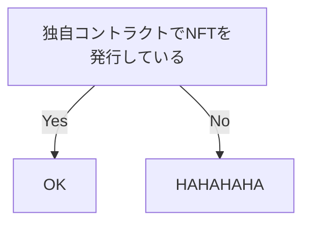

# はじめに
セカンダリマーケットにおける手数料の一部をクリエイターに回すことができる仕組みは、作品をNFTにすることのメリットの一つとして挙げられることは多いです。ここでいう手数料がロイヤリティです。

継続的な報酬がクリエイターに入ることでプロジェクトの持続可能性が上がり、NFTのホルダーにとってもwin-winな仕組みといえます。

しかし、作品をNFTにするだけで勝手にロイヤリティが入るわけではないことに注意しなければいけません。NFT自体にロイヤリティ情報を持たせることはもちろんですが、それらを売買するマーケットプレイスの設計にも依存します。

そこで、これからNFTを開発する方にもわかりやすく、ロイヤリティの仕組みや組み込み方法をまとめたいと思います。

# 前提
- ERC721/ERC1155で発行したNFTが対象
- セカンダリセールを想定

# tl;dr
- ロイヤリティの分配はマーケットプレイスにも依存する
- マーケットプレイスを跨いだNFTの作成・売買は、ロイヤリティが受け取れない場合があるよ
- 既にNFTを発行済みだけどロイヤリティの設定を忘れてしまった場合は、Royalty Registryがあるよ

# NFTにおけるロイヤリティとは
基本的にNFTはOpenSeaなどのマーケットプレイスで売買されます。マーケットプレイスには、幅広いカテゴリを横断的に扱っているものや、特定のカテゴリに特化しているもの、特定のゲーム内アイテムに特化しているものなど数多くのタイプが存在しています。

そして、ロイヤリティの分配は基本的にマーケットプレイスなどのアプリケーションレイヤーの実装方法に左右されます。

## 分配タイミング
NFTを売買するときに、マーケットプレイスへの手数料やクリエイターへのロイヤリティが分配されます。このとき、手数料はマーケットプレイス側で設定されている割合で勝手に徴収されるのですが、ロイヤリティはNFTの作成者が独自に設定する必要があります。

## 分配の実現方法
これはマーケットプレイスによって異なります。要はロイヤリティ情報をどこに保存しているのかの違いです。例えば、従来のDB管理（Off-Chain）やスマートコントラクト上での実装（On-Chain）などの方法があります。

いくつか代表的な例を挙げます。
| マーケットプレイス | 規格 |
| ---- | ---- |
| OpenSea | Off-Chain |
| Rarible | 独自規格（On-Chain） |
| Foudation | 独自規格（On-Chain） |
| Coinbase NFT | ERC2981 + Royalty Registry |

ここで気をつけなければならないのが、NFTの作成・売買が複数マーケットプレイスを跨ぐとロイヤリティを受け取れない（場合がある）、ということです。

OpenSeaは分かりやすいと思うのですが、ロイヤリティ情報が運営のDBに保存してあるとき、それ以外のマーケットプレイスはロイヤリティ情報にアクセスできません。そのため、OpenSeaのストアフロントでmintしたNFTは、OpenSeaで売買されない限りロイヤリティを受け取ることができません。（OpenSeaのvolumeを見て他のマケプレで売買されることを想定しないのであれば、それでもいいと思います）

## それで、私はロイヤリティを受け取れるの？

# （独自コントラクト向け）ロイヤリティを設定する方法

## これからコントラクトを作成する場合
ERC2981の規格に準拠したNFTを作成してください。

## すでにNFT発行済みだけど、ロイヤリティ設定がない場合
安心してください、Royalty Registryがあります。

# まとめ
ロイヤリティの仕組みについて調べるにつれて、独自コントラクトでNFTを作成しておくことが未来の選択肢を減らすリスクヘッジになるかなと思いました。

# 参考
https://eips.ethereum.org/EIPS/eip-2981
https://help.coinbase.com/en/nft/creators/royalties
https://dune.com/thomas_m/NFT-stats
